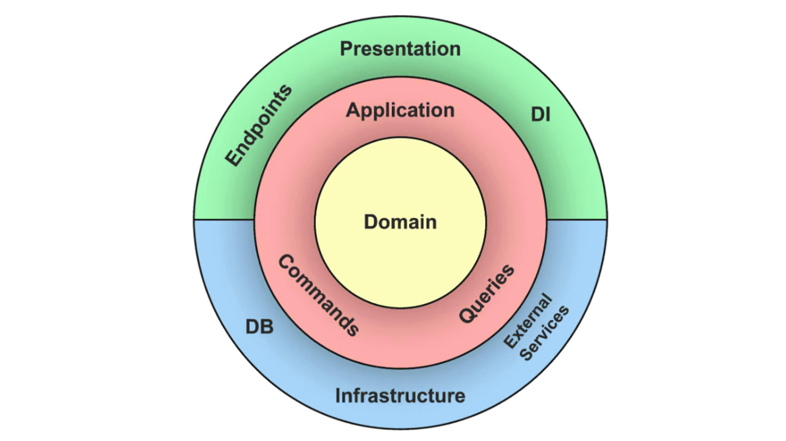

# Software Architecture
The service's codebase follows the **Clean Architecture** approach, a design methodology that emphasizes separation of concerns by structuring code into distinct layers.

This structure ensures that:
- **Core business logic** remains independent of frameworks, databases, or user interfaces.
- The system is **maintainable**, **testable**, and **adaptable** to changes in technology or requirements.

---
## How It Works

Clean Architecture organizes your code into concentric layers, each with clear responsibilities and dependencies that point inward.
The layers, from the outermost to the innermost, are:

1. **Presentation Layer**
   - Handles user interactions (e.g., web requests, CLI inputs, or mobile UI).
   - Responsible for gathering input and presenting output.
   - Relies on the **Application Layer** for processing workflows.

2. **Infrastructure Layer**
   - Isolates external concerns like databases, APIs, and external services.
   - Provides implementations for interfaces defined by the **Application Layer**.
   - Handles technical details, such as persistence, networking, or logging.

3. **Application Layer**
   - Does not contain business rules but uses the **Domain** to achieve goals.
   - Defines application-specific use cases and orchestrates them, ensuring workflows adhere to business rules.
   - Acts as the mediator between the **Infrastructure/Presentation** and the **Domain** layers.

4. **Domain**
   - Represents the core business rules and logic.
   - Contains entities, value objects, and domain services.
   - Completely independent of all other layers, making it highly reusable and testable.

## Key Benefits

1. **Separation of Concerns**:
   - Each layer has a well-defined role, reducing complexity.

2. **Maintainability**:
   - Core business logic is isolated, making changes easier to implement.

3. **Testability**:
   - You can test the **Domain** and **Application** Layers independently of external systems.

4. **Flexibility**:
   - Replace frameworks, databases, or UIs without modifying the Domain.

## Responsibilities of Each Layer

1. **Presentation Layer**:
   - Handles user input and output (e.g., HTTP requests, UI rendering).
   - Converts user actions into requests for the Application Layer.
   - Displays processed data from the Application Layer back to users.

2. **Infrastructure Layer**:
   - Provides implementations for technical operations such as:
     - Database access.
     - External API calls.
     - File system operations.
   - Handles external dependencies and ensures they remain replaceable.
   - Implements interfaces defined by the Application Layer to stay decoupled.

3. **Application Layer**:
   - Coordinates workflows and enforces application rules.
   - Mediates between the Infrastructure and the Domain layers.
   - Ensures business processes are correctly executed using the Domain.

4. **Domain**:
   - Contains the fundamental business logic and rules.
   - Operates independently of the application's infrastructure, frameworks, or user interfaces.
   - Defines the most stable, reusable, and testable part of the system.

---
## Documentation and good practices:
For inspiration 💡:
- [Clean Architecture Principles](https://github.com/pcah/python-clean-architecture/blob/master/docs/PRINCIPLES.md)
- [Clean Architecture - Python example](https://medium.com/@shaliamekh/clean-architecture-with-python-d62712fd8d4f)
