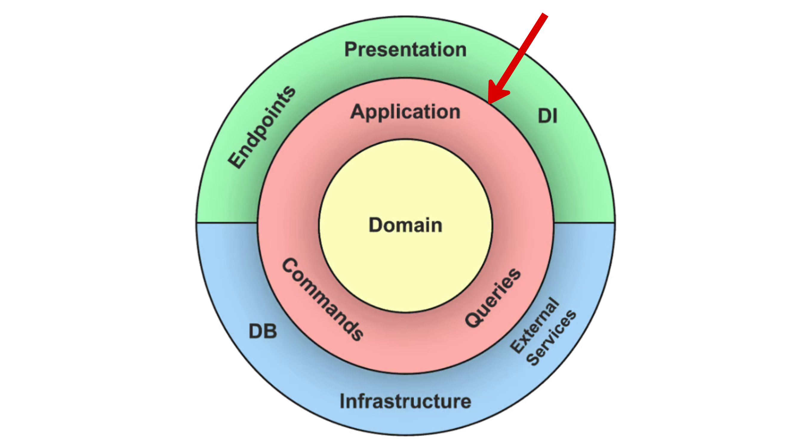

# **Application Layer**
The **Application Layer** orchestrates the flow of data and use cases, bridging the domain layer with external systems like APIs or the presentation layer. It acts as the glue that ensures business rules are applied correctly.

## **Responsibilities**
- Define and implement application-specific use cases.
  *Example*: Create data products, approve an approval request
- Orchestrate interactions between the **Domain** and **Infrastructure** layers.
- Validate inputs and enforce preconditions before invoking domain logic.
- Perform authorization and authentication checks.
- Manage transactions, ensuring consistency during complex operations.
- Coordinate external calls and data formatting between layers.

## **What It Is Not Responsible For**
- **Core Business Logic**: This belongs to the Domain Layer.
- **Direct Data Access**: Managed by the Infrastructure Layer.
- **Rendering Responses or Views**: Done in the Presentation Layer.
- **Storing or Fetching Data**: Handled by repositories in the Infrastructure Layer.

## **What Belongs in the Application Layer**

- **Use Case Handlers**: Encapsulate single use case flows.  
  *Example*: A service method that coordinates a "PlaceOrder" use case, invoking domain entities and handling preconditions.
- **Event Handlers**: Handle domain events (internal events) and integration events (that come from different services).  
  *Example*: A listener for a "PaymentReceived" domain event that triggers a shipping request.
- **Application Services**: Combine and manage multiple use cases.  
  *Example*: A service combining "RegisterUser" and "SendWelcomeEmail" use cases into a single workflow.
- **Validation Logic**: Input validation prior to domain processing.  
  *Example*: Checking if an "OrderQuantity" is within permissible limits before passing it to the domain layer.
- **Authorization Logic**: Deciding access to a use case.  
  *Example*: Verifying if a user has the "Admin" role before allowing access to a "DeleteUser" use case.
