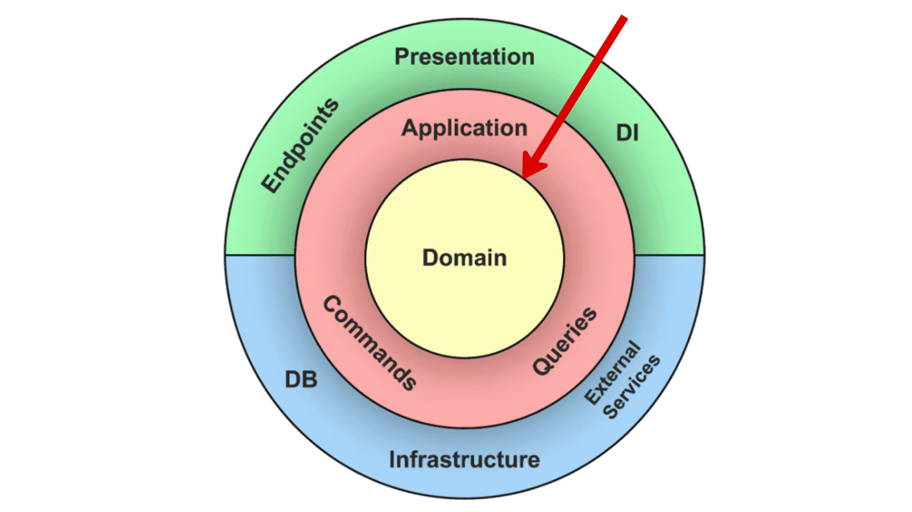

# Domain Layer
The **Domain** Layer represents the heart of the system, containing all the essential business logic, rules, and concepts that define the application's purpose. It is completely independent of any external layers, ensuring that the core functionality remains stable, reusable, and unaffected by changes in technology or infrastructure.

## Responsibilities
1. Represent the core entities of the business with well-defined attributes and behaviors.
2. Enforce domain invariants and business rules within the entities.
3. Define value objects to encapsulate concepts that are immutable and logically cohesive (e.g., Money, Email).
4. Provide domain services for operations that involve multiple entities but do not belong to a single entity.
5. Encapsulate domain events to capture significant occurrences within the business.
6. Serve as the foundation for all other layers, ensuring that business rules are not spread across the codebase.

## What It Is Not Responsible For
1. **Infrastructure Concern**s: The **Domain** Layer should not interact with external systems, databases, or services. These tasks belong to the **Infrastructure** Layer (e.g., data access, API calls).
2. **Presentation Logic**: The **Domain** Layer does not handle UI-related tasks such as formatting data for display or managing user input. These are handled by the **Presentation** Layer.
3. **Application Flow & Orchestration**: The **Domain** Layer does not orchestrate processes or manage application workflows. The Application Layer coordinates domain logic execution.
4. **External Frameworks and Libraries**: The **Domain** Layer should remain independent of external frameworks (e.g., web frameworks, ORM systems). It should contain pure business logic.
5. **Error Handling and Logging**: The **Domain** Layer may raise exceptions but should not manage logging or error handling. These are managed by the **Application** or **Infrastructure** Layers.
6. **Cross-Cutting Concerns**: Tasks like authentication, authorization, or caching are not part of the Domain Layer. They should be handled in the **Application** or **Infrastructure** Layers.
7. **User Interface Interactions**: The Domain Layer does not handle HTTP requests, sessions, or UI-related logic. These tasks belong to the **Presentation** Layer.

## What Belongs in the Domain Layer
1. **Business Entities**
   Represents key business concepts with attributes and behavior.

2. **Value Objects**
   Represents immutable concepts, often used within entities.

3. **Aggregates**
   Groups related entities that must stay consistent as a whole

4. **Domain Services**
   Contains complex business logic that doesn't belong to a single entity.
   *Example*: `PaymentProcessingService` that calculates and processes payments.

5. **Domain Events**
   Represents significant domain occurrences that trigger actions.

6. **Business Rules & Validation**
   Ensures the integrity of domain logic and state.

7. **Specifications**
   Defines reusable business rules or queries.

8. **Custom Exceptions**
    Represents domain-specific errors or invalid states.
    *Example*: `GymCannotHaveMoreRoomsThanSubscriptionAllowsError`.
