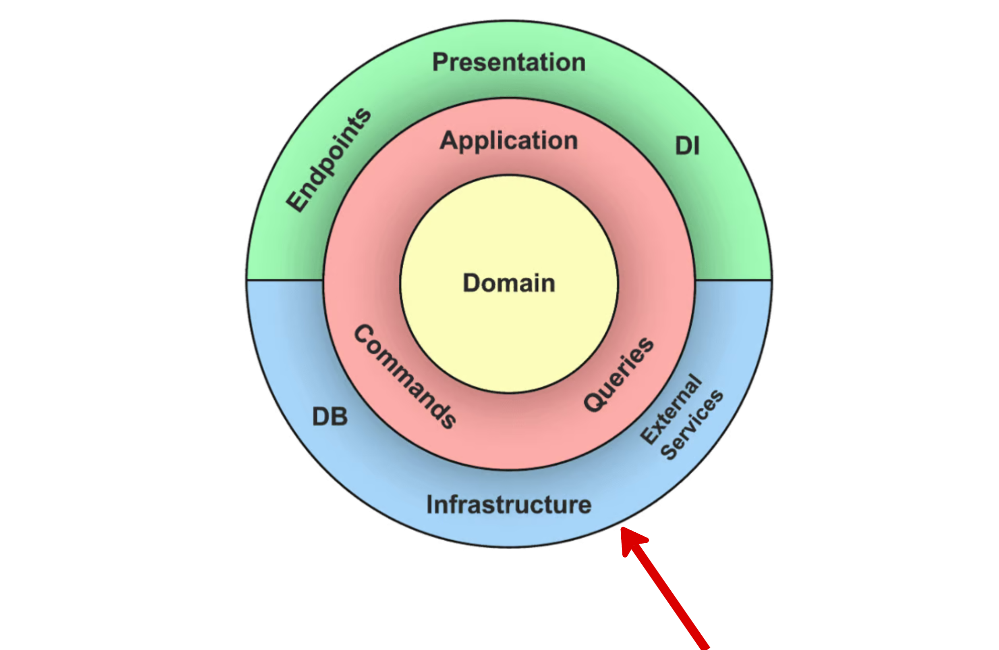

# **Infrastructure Layer**
The **Infrastructure Layer** provides technical capabilities, such as database access, API communication, and other integrations, necessary for the system to function.

## **Responsibilities**
- Manage data persistence by implementing repository interfaces.  
  *Example*: `SubscriptionPostgresRepository` for database operations.
- Integrate with third-party services and external APIs.  
  *Example*: Calling a payment gateway API.
- Handle cross-cutting concerns such as logging, caching, and monitoring.
- Configure and manage infrastructure-related settings.
- Implement message queues and event handlers for async workflows.

## **What It Is Not Responsible For**
- **Application Logic**: Orchestrated by the Application Layer.
- **Business Logic**: Resides in the Domain Layer.
- **API Endpoints**: This is part of the Presentation Layer.

## **What Belongs in the Infrastructure Layer**
- **Repositories**: Concrete implementations of domain repository interfaces.  
  *Example*: `SubscriptionPostgresRepository`.
- **Third party clients**: Communication with external APIs or services.
  *Examples*:
    - `AWS SDK`
    - `Google OAuth2
    - `Azure`
- **Configuration and Setup**: Connection settings for external services.  
  *Example*: `config.yml` for database credentials.
- **Event Publishers/Consumers**: Handle async messaging with tools like RabbitMQ, Pulsar or Kafka.  
  *Example*: `OrderUpdatedHandler`.
