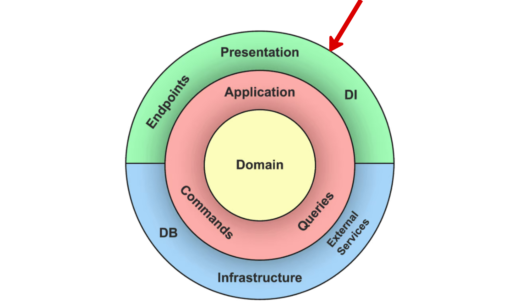

# **Presentation Layer**
The **Presentation Layer** is the entry point for user or system interactions. It processes requests, interacts with the Application Layer, and formats responses.

## **Responsibilities**
- Handle user or system requests and map them to use cases.
  *Example*: Processing a login request through an API.
- Render responses in a user-friendly or system-expected format.
  *Example*: JSON responses for API consumers.
- Validate and sanitize input data before passing it to the Application Layer.
- Manage UI-related state and logic for user interactions.
- Provide error messages and appropriate HTTP status codes.

## **What It Is Not Responsible For**
- **Business Logic**: This belongs to the Domain Layer.
- **Application Logic**: Handled by the Application Layer.
- **Data Persistence**: Managed by the Infrastructure Layer.

## **What Belongs in the Presentation Layer**
- **Controllers**: Handle incoming requests and invoke corresponding use cases.
  *Example*: `UserController` for login and registration endpoints.
- **Request/response mapping**: Mapping request and response schemas into internal service language
  *Example*: mapping `CreateOrderRequest` to `CreateOrder` command
- **Validators**: Ensure the correctness of user inputs.
  *Example*: Pydantic models in FastAPI for input validation.
- **API Endpoints**: API request/response schemas
  *Example*: FastAPI route definitions
- **Session Management**: Handle short-term session data.
  *Example*: JWT token parsing and validation.
